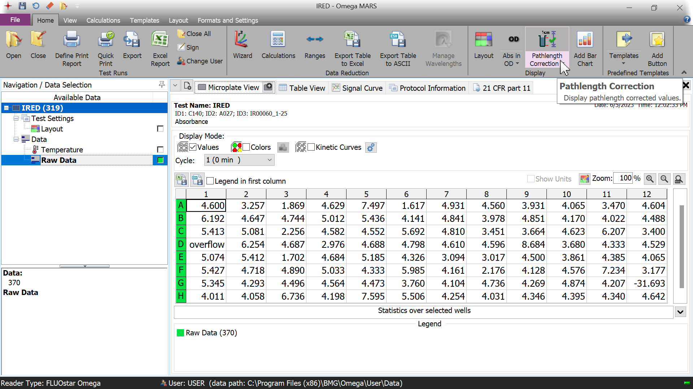
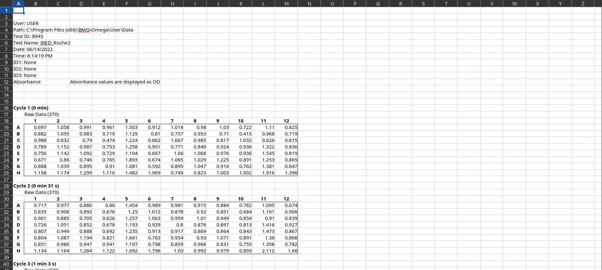
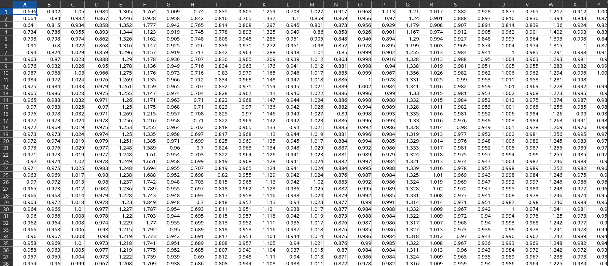

# Diversification Screening
## Table of Contents
- [Introduction](#introduction)
- [Usage](#usage)

## Introduction
This is a brief introduction of the project.
The robotic system from *Beckman Coulter, Biomek i5* equipped with a photometer was used for the photometric assay.
The diverse activity pattern required manual fitting. In sense of high-throughput a script was written, which automatically fits the data by moving average. After the fit with moving average, a linear fit is applied and the slope of this is extracted, the maximum activity.

## Usage
### Date remodeling
First with the *Omega Fluostar* software, the measured data needs to be exported as excel file, without path correction.\

The file output is then remodeled, that every kinetic measurement occupies each one single column, with each row a measurement at different time. With 96 wells, you end up with 96 column. 
Finally, the output of the software

can be remodeled.
You will receive the outputfile in a new folder called output after running the script\
`python remodel-data.py`\
after which the files will have this format\

### Data fitting
You can then run the script to obtain the maximum slope of each reaction, in a table that has the same dimension as your deepwell plate (8x12) with the following script\
`python fit-moving-average.py` (general fit with statistical approach) \
or\
`python plot-graphs-fast.py` (method with function analysis for fast reactions)\
or\
`python plot-graphs-artifact.py` (method with function analysis for reactions)

It will again ask you for a userinput. On windows, make sure you enter the whole path like X:\\User\\path\\.. 
Be aware that the unit of the displayed activities is OD/s.In order to check if the fit is correclty done, you can check the generated plots, if neccesarry you can easily cope the column of your interest to a new excel file and fit manually if you are not satisfied with the automatic fit.

The output 8x12 slope matrix can easily be pasted to another evaluation excel template.

## Heatmap generation
To start the combination of individual template sheets, you should have all of them in one folder. \
Generate a new folder, called "output" in the folder where all of the template sheets are stored.\
The script **summary-hits-only-amine-scope.py** should be copied also in that folder.

After running the script\
`python summary-hits-only-amine-scope.py`

Two new files will appear in the output folder:
* alldata_amine-scope.xlsx (as it says, all data, even the substrate combinations with no hit)
* matrix-amine-hits-only.xlsx (combinations removed with no activity and also combinations that were not evaluable)

With the script\
`python get-matrix.py`\
you can extract how many hits per substrate combination were.
It will ask you for a user input:\
**Enter the file path:** \
were should enter the file path of your `matrix-amine-hits-only.xlsx` file.
In order to obtain a heatmap out of it, you must first sort this data according to your plate layout.
So instead of a single column, you should end up with a text file of 8x12 dimension (you can sort the data in excel and copy the table to a editor file).
You can paste the output of the matix.csv file in the A and B column of the `give-matrix-heatmap.ods` file, but copy only the table without labels to a text file.

You can generate the heatmap then with\
`python heatmap.py`\
It will ask you for a user input\
**Please enter the filepath for the matrix file:**\
were you should enter the filepath of your generated **matrix.txt** file.

